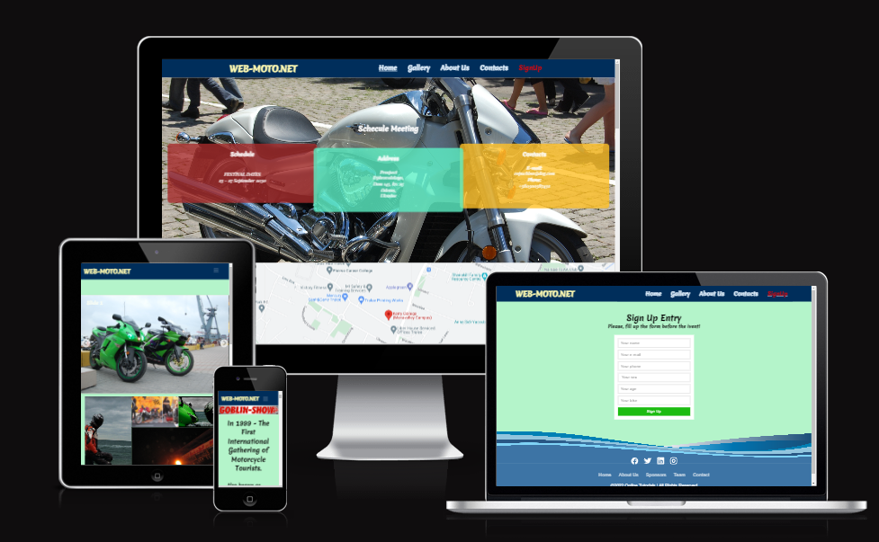
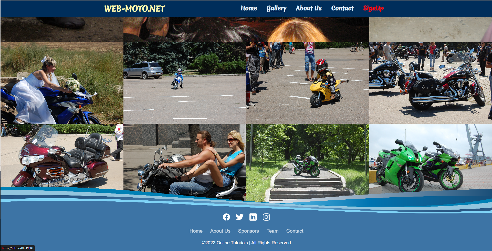
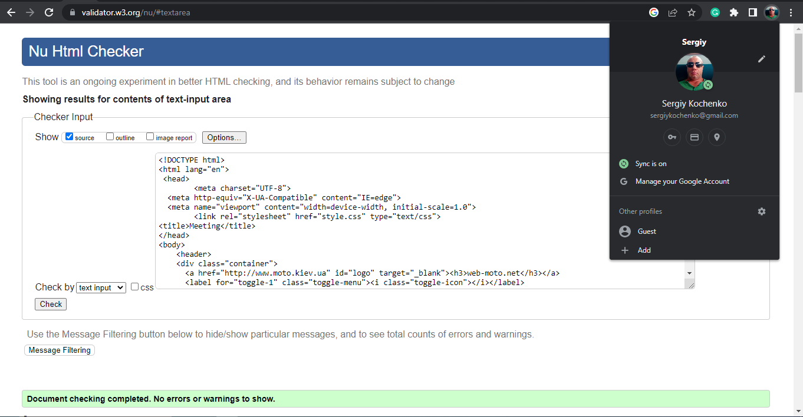
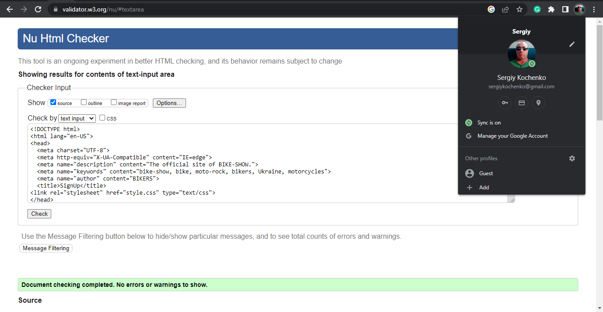
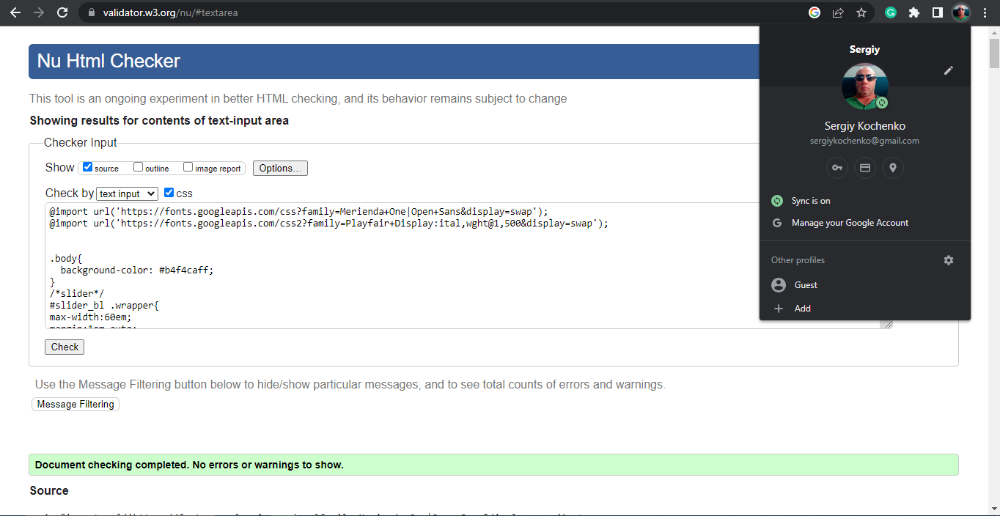

Welcome, all to my first website MOTORCYCLE FESTIVAL!
The motorcycle festival is about to invite people to the MOTORCYCLE FESTIVAL. This website is for motorcycle enthusiasts and festival! It's designed to be a friendly place.  The attention of the advanced public is also attracted by festivals that combine music and various spiritual practices: the so-called "spaces" for self-development and communication with like-minded people.
Of course, the main attraction for the audience is the content. Connoisseurs are eager to find out what the organizer has to offer them. And in the case of music festivals - who can he offer. And here the priority of goals and objectives again comes into force. The situation is twofold: on the one hand, the desire for commercial success of the project, to reach a wider audience dictates the need to invite sonorous names, on the other hand, the audience may be interested and often interested in everything new, including new performers.
The real attraction of this fiesta is the “bike show and music”, goodwill and a convivial atmosphere for all. From bikers to non-bikers or even aspiring bikers, visitors, tourists, families and locals, BikeFest has something for all. The festival allure can best be described by broad smiles and good humour as everyone soaks up the atmosphere in the Bike Camp located hear the town centre, on the Nikolaev Road, in the grounds of the Dom Pavlovyh Hotel.  Add in an action-packed, fun-fueled programme of events and activities, lots of live music stages day and night, coupled with the opportunity to ride the twisting tracks around the town. 

Features
Featured at the top of the page id the logo (MENU) and the nav bar which in the nav bar you can navigate between the HOME, GALLERY, ABOUT US, CONTACTS  and SIGHN UP, sections which are currently active and adaptive menu. The colour chosen for this page and the font were designed for readable and logical think it suits the page and its aspects and its easy to read and visually pleasing, the fonts are copperplate gothic light as I felt it suits the feel of the page and the type of people who will view this page it’s nice and sharp and stands out. The navigation is clearly labelled for users to easily find their way through the page and the social media links are clickable.

Heading
The Heading clearly states the meaning and purpose of the page it’s in the same font and Colour as the rest of the page as I feel its suits it.

About
The about section explains what the webpage is for and why its been created and what the main goal of the page is.
The home page describes the schedule, the address and contact information.

Gallery
the Gallery section shows some of the trips taken by people who joined on the days advertised and other shows of the event.

Validator screenshots:

index.html lfile

about.html file

form.html file

gallery.html file

style.html file
